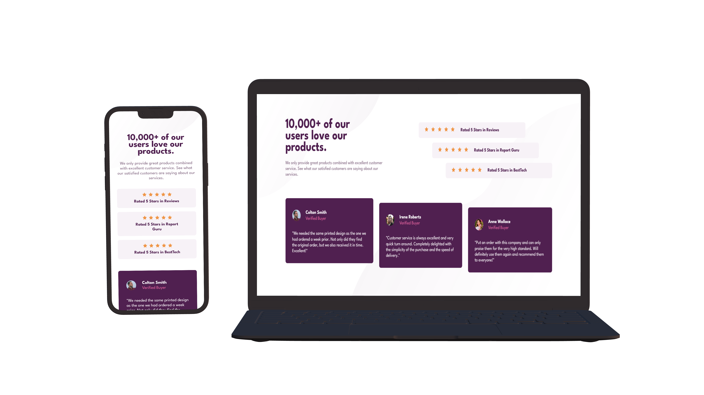

# Frontend Mentor - Social proof section

👋 Hey there!

This is a solution to the [social proof section challenge on Frontend Mentor](https://www.frontendmentor.io/challenges/social-proof-section-6e0qTv_bA/hub/social-proof-section-WnDNFsmKVM). Frontend Mentor challenges help me improve my coding skills by building realistic projects.

## Table of contents

- [Frontend Mentor - Social proof section](#frontend-mentor---social-proof-section)
  - [Table of contents](#table-of-contents)
  - [Overview](#overview)
    - [The challenge](#the-challenge)
    - [Screenshot](#screenshot)
    - [Links](#links)
    - [Built with](#built-with)
    - [What I learned](#what-i-learned)
    - [Continued development](#continued-development)
  - [Author](#author)

## Overview

A new challenge as part of my exercises to master HTML and CSS.

### The challenge

The challenge was to build out this social proof section and get it looking as close to the design as possible. Especially on the desktop, layout was a challenge, but with the help of Grid and Flexbox, I succeeded!

### Screenshot

### Links

- Live Site URL: [Single price grid component](https://ohsorrow.github.io/social-proof-section)
- Solution: [Solution on Frontend Mentor]()

### Built with

- Semantic HTML5 markup
- CSS custom properties
- CSS Grid
- CSS Flexbox

### What I learned

- Combining Grid and Flexbox to layout the page
- Using `justify-content` and `align-items` for centering the items.

### Continued development

Since I learned a lot on this project, I'm looking forward to trying more challenges from Frontend Mentor.

## Author

- [LinkedIn](https://www.linkedin.com/in/aram-moradian/)
- [Telegram](https://t.me/OhSorrow)
- [Frontend Mentor](https://www.frontendmentor.io/profile/OhSorrow)
- [GitHub](https://github.com/OhSorrow)
